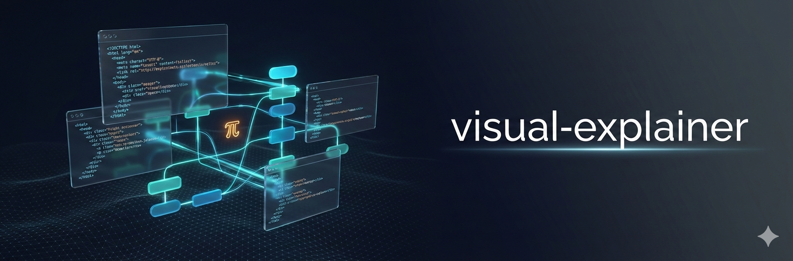

<p>
  
</p>

# visual-explainer

**An agent skill + prompt templates that replace ASCII diagrams with beautiful, self-contained HTML pages — architecture overviews, flowcharts, diff reviews, data tables, and more.**

[](LICENSE)

```
> draw a diagram of our authentication flow

> visualize the database schema

> /diff-review main
```

The agent builds a styled HTML page — CSS Grid layouts, Mermaid flowcharts, Google Fonts, dark/light themes, staggered animations — and opens it in your browser. One file, no build step, no dependencies.

## Why

Every coding agent defaults to ASCII art when you ask for a diagram. Box-drawing characters, monospace alignment hacks, text arrows. It works for trivial cases, but anything beyond a 3-box flowchart turns into an unreadable mess that nobody would put in a presentation or share with a team.

It gets worse with tables. Ask the agent to compare 15 requirements against a plan and you get a wall of pipes and dashes that wraps and breaks in the terminal. The data is there but it's painful to read.

This skill replaces all of that with real HTML pages that look like someone designed them — because the agent follows a design-aware workflow with reference templates, CSS patterns, and font pairings before generating each diagram.

## Install

The skill follows the [Agent Skills specification](https://agentskills.io/specification). Clone it into your agent's skills directory:

### Pi

```bash
git clone https://github.com/nicobailon/visual-explainer.git ~/.pi/agent/skills/visual-explainer
```

Restart Pi. The skill auto-discovers from the skills directory.

To get the slash commands (`/diff-review`, `/plan-review`, etc.), copy the prompt templates and install the [pi-prompt-template-model](https://github.com/nicobailon/pi-prompt-template-model) extension for skill auto-injection:

```bash
cp ~/.pi/agent/skills/visual-explainer/prompts/*.md ~/.pi/agent/prompts/
pi install npm:pi-prompt-template-model
```

Without the extension the prompts still work as normal templates, but the agent won't get the skill auto-injected — it would need to discover and load it on its own.

### Claude Code

```bash
git clone https://github.com/nicobailon/visual-explainer.git ~/.claude/skills/visual-explainer
```

### Other agents

Any agent that supports the Agent Skills spec can load the skill by pointing at the directory containing `SKILL.md`. If your agent doesn't support auto-discovery, paste the contents of `SKILL.md` into your system prompt directly.

### Manual (no git)

```bash
mkdir -p ~/.agent/skills/visual-explainer
curl -L https://github.com/nicobailon/visual-explainer/archive/refs/heads/main.tar.gz | \
  tar -xz --strip-components=1 -C ~/.agent/skills/visual-explainer
```

### Optional: AI-generated images

If you have [surf-cli](https://github.com/nicobailon/surf-cli) installed with its Chrome extension, the skill can generate illustrations via Gemini Nano Banana Pro and embed them in diagrams — hero banners, conceptual illustrations, educational diagrams. The agent checks for surf availability automatically and skips image generation gracefully if it's not installed. Everything else works without it.

## Usage

**Ask naturally.** The agent sees the skill description and loads it when you mention diagrams, architecture, flowcharts, schemas, or visualizations:

```
> draw a diagram of our authentication flow
> visualize the database schema
> create an architecture overview of the notification system
```

**Proactive table rendering.** When the agent is about to render a complex ASCII table (4+ rows or 3+ columns), it generates a styled HTML table instead and opens it in the browser. Comparisons, audits, feature matrices, status reports — anything tabular gets the HTML treatment automatically.

**Force-load** if the agent doesn't pick it up on its own:

```
> /skill:visual-explainer draw the microservices architecture
```

Output goes to `~/.agent/diagrams/` and the result opens in your browser.

## Prompt Templates

The skill ships with five prompt templates that become slash commands in Pi:

| Command | What it does |
|---------|-------------|
| `/generate-web-diagram` | Generate an HTML diagram for any topic |
| `/diff-review` | Visual diff review — before/after architecture, KPI dashboard, code review, decision log |
| `/plan-review` | Compare a plan against the codebase — current vs. planned architecture, risk assessment |
| `/project-recap` | Visual snapshot for context-switching back to a project after days away |
| `/fact-check` | Verify factual accuracy of a review page, plan doc, or spec against the actual code |

### `/diff-review`

Accepts any git ref. Generates architecture comparison, file map, structured Good/Bad/Ugly code review, decision log with confidence indicators, and re-entry context.

```
/diff-review main              # feature branch vs main (default)
/diff-review abc123            # single commit
/diff-review main..HEAD        # committed changes only
/diff-review #42               # pull request
/diff-review HEAD              # uncommitted changes only
```

### `/plan-review`

Compares a codebase against an implementation plan. Current vs. planned architecture diagrams, change-by-change breakdown, dependency analysis, risk assessment, and Good/Bad/Ugly review of the plan itself.

```
/plan-review ~/docs/refactor-plan.md            # plan + working directory
/plan-review ~/docs/refactor-plan.md ./src      # plan + explicit path
```

### `/project-recap`

Mental model snapshot — architecture diagram, recent activity, decision log, working/broken/blocked dashboard, cognitive debt hotspots. Takes an optional time window:

```
/project-recap                 # last 2 weeks (default)
/project-recap 30d             # last 30 days
```

### `/fact-check`

Extracts every verifiable claim from a document (file references, function names, line counts, behavior descriptions), re-checks each against the actual code, corrects inaccuracies, and adds a verification summary:

```
/fact-check                                                   # most recent review page
/fact-check ~/.agent/diagrams/diff-review.html             # specific file
/fact-check ~/Documents/docs/refactor-plan.md                 # plan doc
```

## Diagram Types

| Type | Rendering | When to use |
|------|-----------|-------------|
| Architecture (text-heavy) | CSS Grid cards + flow arrows | System overviews with rich descriptions |
| Architecture (topology) | Mermaid | Service maps, connection diagrams |
| Flowchart / Pipeline | Mermaid | CI/CD, data pipelines, processes |
| Sequence | Mermaid | Service-to-service calls, request flows |
| Data flow | Mermaid with edge labels | ETL, event streaming, message flows |
| Schema / ER | Mermaid | Database schemas, entity relationships |
| State machine | Mermaid | State transitions, decision trees |
| Mind map | Mermaid | Hierarchical breakdowns, project structure |
| Data table | HTML `<table>` | Comparisons, audits, feature matrices |
| Timeline | CSS | Roadmaps, release history, project phases |
| Dashboard | CSS Grid + Chart.js | Metrics overviews, KPI displays |

The agent picks the right rendering approach automatically. Mermaid handles anything with connections and automatic edge routing. CSS Grid handles text-heavy content where card descriptions matter more than topology. HTML tables handle structured data.

## How It Works

```
SKILL.md (workflow + design principles)
    ↓
references/           ← agent reads on-demand before each generation
├── css-patterns.md   (layouts, animations, theming, depth tiers)
├── libraries.md      (Mermaid deep theming, Chart.js, anime.js, font pairings)
└── responsive-nav.md (sticky sidebar TOC for multi-section pages)
    ↓
templates/            ← agent reads the matching reference template
├── architecture.html (CSS Grid cards with flow arrows — terracotta/sage palette)
├── mermaid-flowchart.html (Mermaid + ELK + handDrawn mode — teal/cyan palette)
└── data-table.html   (tables with KPIs and status badges — rose/cranberry palette)
    ↓
~/.agent/diagrams/filename.html → opens in browser
```

The agent follows a four-step workflow: pick an aesthetic direction (9 options — monochrome terminal, editorial, blueprint, neon, paper/ink, sketch, IDE-inspired, data-dense, gradient mesh), read the right reference template, generate a self-contained HTML file with both light and dark theme support, and open it. Each template uses a deliberately different color palette so the agent absorbs variety rather than a single look.

Every diagram is a single `.html` file with all styles inlined. The only external requests are Google Fonts and optional CDN libraries (Mermaid, Chart.js, anime.js). No build step, no npm, no bundler. Open it in any browser, send it to a colleague, drop it in a PR.

## Customization

Output directory and browser command are in `SKILL.md` under the "Deliver" section — edit to match your setup. To add diagram types, aesthetic directions, or CSS patterns, edit the respective files. The agent reads them fresh each time, so changes take effect immediately (unless you modify the frontmatter `description`, which needs a Pi restart for re-indexing).

## Limitations

- Diagrams require a browser to view — no inline terminal rendering
- Mermaid diagrams initialize once at page load; switching OS theme requires a refresh for the Mermaid SVG (CSS-styled elements respond instantly)
- Google Fonts need an internet connection on first load (system font fallbacks are included)
- Very complex Mermaid diagrams (50+ nodes) may need the ELK layout engine for clean edge routing, which adds CDN weight
- The agent picks aesthetics based on skill guidance, not pixel-perfect design specs — results vary by model capability

## Credits

Borrows ideas from [Anthropic's frontend-design skill](https://github.com/anthropics/skills) and [interface-design](https://github.com/Dammyjay93/interface-design), adapted for one-shot diagram generation.

## License

MIT
